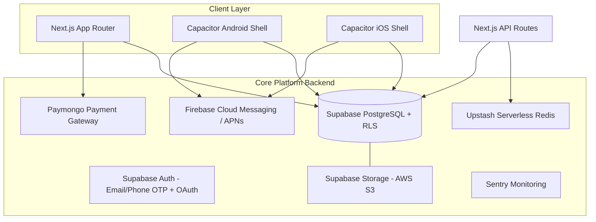

# 🏓 PICKLERS — Complete Project Documentation

> **Find • Book • Play** — A premium, cross-platform pickleball court reservation, tournament management, and player community platform for **Web**, **Android**, and **iOS**.

**App ID:** `com.picklers.app` · **Version:** `0.0.1` · **License:** Private

---

## Table of Contents

1. [Overview](#1-overview)
2. [Product Summary](#2-product-summary)
3. [Tech Stack](#3-tech-stack)
4. [System Architecture](#4-system-architecture)
5. [Repository Structure](#5-repository-structure)
6. [Application Pages & Consoles](#6-application-pages--consoles)
7. [Route Protection & Security Middleware](#7-route-protection--security-middleware)
8. [API Reference](#8-api-reference)
9. [Authentication](#9-authentication)
10. [Role-Based Access Control (RBAC)](#10-role-based-access-control-rbac)
11. [Payments (Paymongo)](#11-payments-paymongo)
12. [Push Notifications](#12-push-notifications)
13. [Frontend Internals](#13-frontend-internals)
14. [Database (Supabase)](#14-database-supabase)
15. [Environment Variables Reference](#15-environment-variables-reference)
16. [Getting Started](#16-getting-started)
17. [Testing & CI/CD](#17-testing--cicd)
18. [Design System Summary](#18-design-system-summary)
19. [Documentation Index](#19-documentation-index)

---

## 1. Overview

**Picklers** is a unified multi-platform application built for pickleball players, court facility owners, tournament directors, and platform staff. It delivers real-time court availability, instant GCash/Maya wallet checkout, live scoreboards, community social features, and lock-screen push notification alerts across all devices.

| Platform | Engine / Tech | Target Binary | Status |
| :--- | :--- | :--- | :--- |
| **Web** | Next.js 16 (App Router), React 18, Vercel Edge | Hosted Web Application | 🟢 Production Ready |
| **Android** | Capacitor v8, Native Android SDK, FCM | `.apk` / `.aab` (Google Play) | 🟢 Configured & Synced |
| **iOS** | Capacitor v8, Xcode, APNs | `.ipa` (App Store / TestFlight) | 🟢 Configured & Synced |

### Core Capabilities

- 🏟️ **Court Discovery & Booking** — map-based facility exploration with real-time availability
- 💳 **Wallet & Payments** — GCash, Maya, QR Ph, and card payments via Paymongo
- 🏆 **Tournaments** — bracket management, live scoreboards, team & match tracking
- 👥 **Community** — social feed, clubs, follows, direct messages, achievements
- 🏢 **Owner Console** — facility management, staff tools, open-play sessions, revenue
- 🛡️ **Business Admin Console** — partner approvals, finance ledger, moderation, analytics
- 🔧 **Developer Control Center** — feature flags, telemetry, logs, threat monitoring, webhooks

---

## 2. Product Summary

### Users

| Persona | Description |
| :--- | :--- |
| **Players** | Pickleball enthusiasts booking courts, finding open matches, joining tournaments, and managing their player profile |
| **Facility Owners** | Club/facility operators managing court availability, hosting tournaments, managing staff, bookings, and payouts |
| **Business Admins** | Platform staff handling partner applications, finance, moderation, and analytics (`/app/admin`) |
| **Developers** | Engineering staff operating flags, telemetry, logs, and diagnostics (`/app/dev`) |

### Purpose

A premium, full-stack pickleball community and booking platform. Success means players can book a court in seconds and owners have zero double-bookings or scheduling errors.

### Brand Personality

"Apple-tier" — premium, flawless, modern. Polished and professional yet dynamic, evoking confidence and high-end software craftsmanship.

### Accessibility

Readable contrast for all body text. Critical states (booking confirmed, match cancelled) are distinctly visible with appropriate color contrast and icons — usable under bright court lighting or in motion.

---

## 3. Tech Stack

| Layer | Technology | Notes |
| :--- | :--- | :--- |
| **Language** | TypeScript (strict) | Frontend + backend |
| **Framework** | Next.js 16 (App Router) | Server Components, API routes, edge runtime |
| **UI Library** | React 18 | |
| **Styling** | Tailwind CSS v4 | With `tw-animate-css` and custom design tokens |
| **Components** | Radix UI (headless), shadcn-style patterns | 20+ accessible primitives |
| **Animations** | Motion (Framer Motion) + GSAP | Micro-interactions & choreography |
| **State** | Zustand (global stores) + TanStack React Query (async cache) | See [Frontend Internals](#13-frontend-internals) |
| **Forms** | React Hook Form + Zod v4 | Schema-validated inputs via `@hookform/resolvers` |
| **Database** | Supabase PostgreSQL | Row Level Security (RLS) enforced multi-tenancy |
| **Auth** | Supabase Auth | Email OTP, Phone OTP, Google/Meta OAuth |
| **Payments** | Paymongo | GCash, Maya, QR Ph, cards (Philippine market) |
| **Rate Limiting / Cache** | Upstash Redis (serverless) | Auth rate limiting (5 req/60s), OTP cooldowns |
| **Maps** | Google Maps JS API + Leaflet/Mapbox GL | Facility discovery & geolocation |
| **Push Notifications** | Firebase Cloud Messaging (FCM) + APNs | Via `@capacitor/push-notifications` |
| **Email** | Resend | Booking receipts, invites, password resets |
| **AI Chat** | OpenRouter (`gpt-4o-mini` default) | "Prend" in-app chatbot |
| **Error Tracking** | Sentry (`@sentry/nextjs`) | Crash reporting & monitoring |
| **Charts** | Recharts | Admin analytics dashboards |
| **Icons** | Lucide React | |
| **Toasts** | Sonner | |
| **Testing** | Vitest + Testing Library + happy-dom/jsdom | Coverage via `@vitest/coverage-v8` |
| **Mobile Shell** | Capacitor v8 | Android & iOS native wrappers |
| **Hosting** | Vercel | Edge network optimized for Next.js |
| **CI/CD** | GitHub Actions → Vercel | Lint, type-check, build on every push |

### Intentionally Omitted from MVP

Upstash QStash (background jobs), Playwright E2E, Expo, live-chat support widgets, Twilio SMS OTP — evaluated but cut to protect budget and prevent over-engineering.

---

## 4. System Architecture



### Dual-Console Separation

The platform enforces a strict split between business operations and engineering tooling:

```
                    ┌───────────────────┐
                    │   Player Portal   │
                    │       /app        │
                    └─────────┬─────────┘
                              │
         ┌────────────────────┴────────────────────┐
         ▼                                         ▼
┌─────────────────────────┐         ┌─────────────────────────┐
│  Business Admin Console │         │ Developer Control Center│
│       /app/admin        │         │        /app/dev         │
└────────────┬────────────┘         └────────────┬────────────┘
             ▼                                   ▼
   <AdminGate> / requireAdmin()     <DevGate> / requireDeveloper()
             ▼                                   ▼
   createAdminSupabase()            createDevServiceSupabase()
   (service-role privileges)        (scoped developer client)
```

All elevated account mutations run server-side through dedicated service-role helpers — client anon keys can never bypass RLS. Both consoles enforce a **last super admin/developer safeguard** and IP-aware sliding-window rate limiting.

---

## 5. Repository Structure

```text
PICKLERS WEB APP/
├── DOCUMENTATION.md             # ← You are here (master documentation)
├── README.md                    # Project quick-start & overview
├── PRODUCT_SPEC.md              # Product requirements & scope
├── DESIGN_SYSTEM.md             # Brand colors, typography, component rules
├── TECH_STACK_WEB.md            # Web technical specifications
├── TECH_STACK_ANDROID.md        # Android wrapper & Gradle config
├── TECH_STACK_IOS.md            # iOS wrapper & Xcode config
├── implementation_plan.md       # Delivery plan
├── docs/                        # Operational guides
│   ├── ADMIN_CONSOLE_GUIDE.md
│   ├── DEVELOPER_CONSOLE_GUIDE.md
│   ├── CONSOLE_SEPARATION_ARCHITECTURE.md
│   └── RBAC_MATRIX.md
└── web/                         # Main application workspace
    ├── src/
    │   ├── app/                 # Next.js App Router
    │   │   ├── (player)/        # Player portal route group → /app/*
    │   │   ├── (owner)/         # Owner console route group → /app/owner/*
    │   │   ├── (admin)/         # Admin console route group → /app/admin/*
    │   │   ├── (developer)/     # Dev console route group → /app/dev/*
    │   │   ├── api/             # REST API endpoints (see §8)
    │   │   ├── auth/            # Auth pages + callback handler
    │   │   ├── privacy/         # Privacy policy page
    │   │   └── terms/           # Terms of service page
    │   ├── components/          # Reusable UI components (Radix-based)
    │   ├── contexts/            # React contexts: Auth, App, Owner, Toast
    │   ├── hooks/               # Custom hooks (paymongo, wallet, courts…)
    │   ├── store/               # Zustand stores (UI, user, wallet, tournament)
    │   ├── lib/                 # Supabase clients, Redis, rate limiter,
    │   │                        #   Capacitor storage/push utils, validations,
    │   │                        #   security/threatDetector
    │   ├── styles/              # Tailwind CSS v4 entry + design tokens
    │   ├── types/               # Shared TypeScript types
    │   ├── imports/             # Imported design assets
    │   └── __tests__/           # Vitest test suites
    ├── supabase/
    │   ├── migrations/          # 43 ordered SQL migrations
    │   ├── setup_all.sql        # One-shot full schema setup
    │   └── seed_*.sql           # Admin, coldstart & demo seed data
    ├── android/                 # Generated native Android project (Gradle)
    ├── ios/                     # Generated native iOS project (Xcode)
    ├── capacitor.config.ts      # Cross-platform native shell config
    ├── middleware.ts (src/)     # Auth guard + honeypot interceptor
    ├── next.config.ts           # Next.js config (incl. Sentry integration)
    ├── vitest.config.ts         # Test runner configuration
    └── package.json             # Scripts & dependencies
```

---

## 6. Application Pages & Consoles

All authenticated experiences live under `/app`, split into four role-scoped consoles.

### 🎾 Player Portal (`/app`)

| Route | Purpose |
| :--- | :--- |
| `/app` | Player home — bookings overview, quick actions |
| `/app/explore` | Map-based facility discovery |
| `/app/facility/[id]` | Facility detail: courts, amenities, reviews, booking |
| `/app/bookings` | Personal reservation history & management |
| `/app/tournaments` | Tournament browse & registration |
| `/app/community` | Social feed, clubs, players, messages |
| `/app/wallet` | Wallet balance & transaction history |
| `/app/settings` | Profile & account settings |
| `/app/owner-application` | Apply to become a facility owner |

### 🏢 Owner Console (`/app/owner/*`)

| Route | Purpose |
| :--- | :--- |
| `/app/owner` | Owner dashboard |
| `/app/owner/facility/[id]` | Manage a facility (courts, hours, photos) incl. announcements & reviews |
| `/app/owner/courts` | Court inventory management |
| `/app/owner/clubs/[id]/members` | Club roster management |
| `/app/owner/tournaments` | Create & run tournaments |
| `/app/owner/open-play` | Schedule open-play sessions |
| `/app/owner/applications` | Staff/partner applications |
| `/app/owner/community` · `messages` · `notifications` · `settings` | Engagement & config tools |

### 🛡️ Business Admin Console (`/app/admin/*`)

| Route | Purpose |
| :--- | :--- |
| `/app/admin` | Control center: KPI cards (revenue, active courts, bookings, growth) + live activity feed |
| `/app/admin/applications` | Partner application review — approve/reject/request revision, staff notes, bulk ops |
| `/app/admin/bookings` | All-facility bookings; administrative cancellations & refunds with audit reasons |
| `/app/admin/users` | User directory: search, ban/unban, admin role assignment, CSV export |
| `/app/admin/finance` | Financial ledger, 10% platform commission tracking, payout marking |
| `/app/admin/promotions` | Promo codes (% or fixed, usage limits, expiry) |
| `/app/admin/analytics` | 30-day revenue trends, peak booking hours, top clubs |
| `/app/admin/moderation` | Content moderation queue |
| `/app/admin/facilities` | Facility oversight & verification |
| `/app/admin/audit-log` | Immutable log of all admin actions |

### 🔧 Developer Control Center (`/app/dev/*`)

| Route | Purpose |
| :--- | :--- |
| `/app/dev` | Dev dashboard & health telemetry |
| `/app/dev/health` | Service health monitoring |
| `/app/dev/logs` | Application log streams |
| `/app/dev/errors` | Error management & incident reports |
| `/app/dev/flags` | Feature flags with % rollouts & targeting filters |
| `/app/dev/environments` | Environment configuration |
| `/app/dev/api-explorer` | Interactive API testing tool |
| `/app/dev/entity-inspector` | Raw database record inspection |
| `/app/dev/accounts` | Account promotion/demotion tools |
| `/app/dev/audit` | Developer action audit trail |
| `/app/dev/threats` | Intrusion detection, IP blocking, threat stats |
| `/app/dev/user-diagnostics` | Per-user debugging |
| `/app/dev/webhooks` | Webhook delivery logs & retries |

---

## 7. Route Protection & Security Middleware

`src/middleware.ts` runs on every request (excluding static assets) and provides:

### 1. Honeypot Interceptor
Known vulnerability-scanner paths (`HONEYPOT_PATHS` from `src/lib/security/threatDetector`) are transparently rewritten to `/api/honeypot/[...slug]`, which traps and logs automated attackers and feeds the Dev Console threat dashboard.

### 2. Session Guard
A Supabase SSR server client reads the auth session with an 8-second timeout race.

- **Unauthenticated** users hitting any `/app/*` route → redirected to `/auth`.

### 3. Role Gates (fail-closed)
For authenticated users, the profile is fetched from `player_profiles` (3.5s timeout) and checked for `account_status`, `is_banned`, `console_access[]`, `is_admin`, `role`, `admin_role`, `dev_role`:

| Route prefix | Access requirement |
| :--- | :--- |
| `/app/admin` | Privileged email, `console_access ∋ admin`, `is_admin`, role `admin`/`dev`, or an `admin_role`/`dev_role` set |
| `/app/dev` | Privileged email, `console_access ∋ dev`, role `admin`/`dev`, or `dev_role`/`admin_role` set |
| `/app/owner`, `/app/create-tournament` | Role ∈ `{owner, demo, admin, dev}` or privileged email/admin flags |

Suspended/deactivated/banned accounts are rejected from all protected routes. On query timeout or error, access **fails closed** for unprivileged users (privileged allow-listed emails are granted fallback access).

---

## 8. API Reference

All backend endpoints are Next.js API routes under `web/src/app/api`. Elevated endpoints use dedicated service-role Supabase clients and IP-aware sliding-window rate limiting.

| Group | Endpoints | Description |
| :--- | :--- | :--- |
| **auth** | OTP send/verify, OAuth intent routing | Passwordless & social login flows |
| **bookings** | Create/list/manage reservations | Court booking lifecycle |
| **tournaments** | `[id]` detail/registration | Tournament data |
| **facilities** | `[id]`, `[id]/announcements`, `[id]/reviews` | Facility data, reviews, announcements |
| **clubs** | `[id]/members`, join flows | Club membership management |
| **open-play-sessions** | Session scheduling/joining | Open-play feature |
| **community** | `feed` (+`[id]` comments/like/upload), `clubs`, `follows`, `likes`, `messages`, `players`, `achievements/check`, `inbox`, `report` | Full social layer |
| **payments** | `checkout`, `webhook` | Paymongo checkout session creation + signed webhook processing (`processed_webhooks` idempotency ledger) |
| **chat** | AI chat proxy | "Prend" chatbot via OpenRouter |
| **email** | Transactional sends | Resend-powered receipts & notifications |
| **notifications** | Push token registration & delivery | FCM/APNs fan-out |
| **health** | Liveness probe | Service monitoring |
| **honeypot** | `[...slug]` catch-all | Traps & logs malicious scanners |
| **admin** | Applications, bookings, users, finance, promotions, analytics, audit | Business Admin Console backend — gated by `requireAdmin()` + `createAdminSupabase()` |
| **dev** | `accounts` (promote/demote/search), `audit`, `entity`, `environments`, `errors/[id]`, `flags/[id]`, `health`, `incidents`, `logs`, `threats` (+stats/block-ip), `user-diagnostics`, `webhooks/[id]/retry` | Developer Control Center backend — gated by `requireDeveloper()` |

> **Security notes:** All admin/dev mutations run through service-role helpers; the last active `super_admin` / `super_developer` cannot be demoted; every privileged endpoint passes through per-IP sliding-window rate limiters with automatic cache GC.

---

## 9. Authentication

Powered by **Supabase Auth** with a passwordless-first design:

| Method | Flow |
| :--- | :--- |
| **Email OTP** | 6-digit code via `input-otp` UI, cooldowns enforced through Upstash Redis |
| **Phone OTP** | SMS one-time passwords |
| **Google OAuth** | Social sign-in with strict intent routing |
| **Meta (Facebook) OAuth** | Requires `META_APP_SECRET` |

Key implementation details:

- Client-side validation with **Zod** schemas (`src/lib/validations.ts`) + custom `useAuthForm` hook
- OAuth callback handled at `/auth/callback` → exchanges the code for a session
- Session persistence on native: **`@capacitor/preferences`** (native storage) instead of cookies, wired through `src/lib/capacitor-storage.ts`
- SSR session management: **`@supabase/ssr`** cookie-based client in middleware and server components
- Three Supabase clients exist by privilege level:
  - `src/lib/supabase.ts` — browser anon client
  - `src/lib/supabase-server.ts` — SSR/server-component client
  - `src/lib/supabase-admin.ts` — service-role (server-only, never shipped to client)

---

## 10. Role-Based Access Control (RBAC)

Roles live on `player_profiles` as `console_access TEXT[]`, `admin_role TEXT`, and `dev_role TEXT`. Full matrix in [docs/RBAC_MATRIX.md](docs/RBAC_MATRIX.md).

### Business Admin Console roles (`admin_role`)

| Role | Access | Key Permissions |
| :--- | :--- | :--- |
| `super_admin` | Full console | All business actions, promote/demote admins, settings, payouts |
| `platform_admin` | Full console | Facilities, promo codes, users, moderation, analytics |
| `operations_admin` | Operations | Application approvals, court verification, bookings |
| `finance_admin` | Finance & reporting | Ledger, refunds, payouts, promo audit |
| `moderator` | Content & users | Post moderation, chat review, warnings, temporary bans |

### Developer Control Center roles (`dev_role`)

| Role | Access | Key Permissions |
| :--- | :--- | :--- |
| `super_developer` | Full dev console | All engineering tools, role management, raw diagnostics |
| `platform_engineer` | Full dev console | Flags, environment config, webhooks, API explorer |
| `sre_devops` | Observability & ops | Health telemetry, logs, error/incident management |
| `backend_engineer` | APIs & logs | API explorer, DB inspector, error logs, user diagnostics |
| `frontend_engineer` | Observability & flags | Error logs, flag viewer, user diagnostics |
| `security_engineer` | Audit & roles | Audit trail inspection, access reviews |
| `developer_viewer` | Read-only | View-only health, logs, public telemetry |

---

## 11. Payments (Paymongo)

Optimized for the Philippine market:

1. Player initiates checkout → `POST /api/payments/checkout`
2. Server creates a Paymongo checkout session (GCash, Maya, QR Ph, or card)
3. Payer completes payment in their wallet app or via card form
4. Paymongo fires a signed webhook → `POST /api/payments/webhook`
5. Webhook signature verified against `PAYMONGO_WEBHOOK_SECRET`; events are recorded idempotently in the `processed_webhooks` table
6. Wallet balances update via the `increment_wallet_balance` PostgreSQL RPC

Deep linking back from wallet apps is handled natively via `@capacitor/app`. Platform commission on bookings is **10%**, tracked in the admin finance ledger.

---

## 12. Push Notifications

- **Android:** Firebase Cloud Messaging (FCM); **iOS:** APNs
- Registered via `@capacitor/push-notifications`; token registration and delivery fan-out handled by `/api/notifications`
- Lock-screen alerts configured in `capacitor.config.ts`: `presentationOptions: ['badge', 'sound', 'alert']`
- Utility layer in `src/lib/push-notifications.ts`

### Capacitor Native Shell

```ts
// capacitor.config.ts (key excerpt)
appId: 'com.picklers.app',
webDir: 'out',
server: { url: 'https://picklers.vercel.app', androidScheme: 'https', iosScheme: 'https' }
```

The native apps load the deployed production website inside a secure WebView (HTTPS-only, mixed content disabled) while granting full access to Capacitor plugins (Preferences, Push, Keyboard, StatusBar, App).

---

## 13. Frontend Internals

### React Contexts (`src/contexts/`)

| Context | Responsibility |
| :--- | :--- |
| `AuthContext` | Session state, user profile, sign-in/out, role helpers |
| `AppContext` | Global app-level state |
| `OwnerContext` | Active facility/owner session data for the owner console |
| `ToastContext` | Toast notifications (Sonner-backed) |

### Zustand Stores (`src/store/`)

`useUIStore`, `useUserStore`, `useWalletStore`, `useTournamentStore` — lightweight global UI/domain state.

### Custom Hooks (`src/hooks/`)

| Hook | Purpose |
| :--- | :--- |
| `usePaymongo` | Payment intent & checkout flows |
| `useWallet` | Wallet balance & transactions |
| `useCourts` | Court data fetching/caching (React Query) |
| `useFileUpload` | Supabase Storage uploads (avatars, court photos, feed media) |
| `useGeolocation` | Device location for map discovery |
| `useConsoleTelemetry` | Dev console instrumentation |
| `useAuthForm` | Auth form orchestration + validation |
| `useActionLock` | Prevents double-submission of critical actions |

### Utility Libraries (`src/lib/`)

- `supabase.ts` / `supabase-server.ts` / `supabase-admin.ts` — tiered DB clients
- `redis.ts` + `rateLimit.ts` — Upstash Redis and the custom sliding-window rate limiter
- `capacitor-storage.ts`, `push-notifications.ts`, `platform.ts` — native bridge utilities
- `validations.ts` — Zod schemas; `timeUtils.ts`; `utils.ts`; `demoData.ts`
- `security/threatDetector.ts` — honeypot path list & threat detection

---

## 14. Database (Supabase)

PostgreSQL schema is managed through **43 ordered migrations** in `web/supabase/migrations/`. Highlights:

| Migration | Purpose |
| :--- | :--- |
| `create_core_tables` | Profiles, facilities, courts foundation |
| `create_bookings_table` | Reservation lifecycle with unique-active-booking index (no double-booking) |
| `create_tournaments_table` / `create_matches_and_teams` / `create_match_games` | Tournament engine |
| `create_community_tables`, `phase1_feed_and_messaging`, `feed_optimizations` | Social feed, clubs, follows, messaging |
| `create_wallets_and_rpc`, `create_wallet_transactions` | Wallet ledger + balance RPC |
| `create_facility_applications*` | Owner/partner onboarding pipeline |
| `multi_tenant_architecture`, RLS policies | Strict tenant separation |
| `add_role_to_profiles`, `rbac_and_sandbox`, `admin_system`, `dev_console_system` | RBAC columns & console backends |
| `intrusion_detection_system` | Threat telemetry powering `/app/dev/threats` |
| `search_indexes` | PostgreSQL full-text search |

**Setup:** run `web/supabase/setup_all.sql` in the Supabase SQL editor for a full one-shot schema, then optionally apply the seed scripts:

- `seed_admin_credentials.sql` — bootstrap admin/dev accounts
- `seed_coldstart.sql` — cold-start content
- `seed_demo_account.sql` — demo player/owner accounts

---

## 15. Environment Variables Reference

Copy `web/.env.example` → `web/.env.local` and fill in values. In production, set them in **Vercel → Settings → Environment Variables**.

| Variable | Used For | Scope |
| :--- | :--- | :--- |
| `NEXT_PUBLIC_SUPABASE_URL` / `NEXT_PUBLIC_SUPABASE_ANON_KEY` | Supabase browser/SSR client | Public |
| `SUPABASE_SERVICE_ROLE_KEY` | Service-role server operations (admin/dev consoles, webhooks) | 🔒 Secret |
| `PAYMONGO_TEST_SECRET_KEY` / `PAYMONGO_TEST_PUBLIC_KEY` | Paymongo sandbox payments | 🔒 Secret / Public |
| `PAYMONGO_LIVE_SECRET_KEY` / `PAYMONGO_LIVE_PUBLIC_KEY` | Paymongo production payments | 🔒 Secret / Public |
| `PAYMONGO_WEBHOOK_SECRET` | Webhook signature verification | 🔒 Secret |
| `NEXT_PUBLIC_MAPS_API_KEY` | Google Maps JS API (facility discovery) | Public |
| `NEXT_PUBLIC_GOOGLE_API_KEY` | Other Google API access | Public |
| `SUPABASE_AUTH_CALLBACK_URL` / `NEXT_PUBLIC_...` | OAuth callback routing | Mixed |
| `META_APP_SECRET` | Facebook OAuth (optional) | 🔒 Secret |
| `TWILIO_RECOVERY_CODE` | Phone OTP recovery (optional) | 🔒 Secret |
| `RESEND_API_KEY` | Transactional email delivery | 🔒 Secret |
| `NEXT_PUBLIC_SENTRY_DSN` / `SENTRY_AUTH_TOKEN` | Error tracking & source-map uploads | Mixed |
| `UPSTASH_REDIS_REST_URL` / `UPSTASH_REDIS_REST_TOKEN` | Rate limiting & OTP cooldowns | 🔒 Secret |
| `OPENROUTER_API_KEY` / `OPENROUTER_MODEL` | Prend AI chatbot | 🔒 Secret |
| `NEXT_PUBLIC_SITE_URL` | Deployed app URL (required in production) | Public |
| `NODE_ENV` | Environment flag | Auto |

> ⚠️ Never commit `.env.local`. All service-role keys must stay server-side only.

---

## 16. Getting Started

### Prerequisites

- **Node.js 22+** and npm
- A Supabase project (URL + keys)
- Android Studio (for Android builds) / Xcode (for iOS builds)

### 1. Install

```bash
cd web
npm install
```

### 2. Configure environment

```bash
cp .env.example .env.local   # then fill in your keys
```

### 3. Run the web app

```bash
npm run dev
# → http://localhost:3000
```

### 4. Available scripts (`web/package.json`)

| Script | Command | Description |
| :--- | :--- | :--- |
| `dev` | `next dev` (4 GB heap) | Development server |
| `build` | `next build` | Production build |
| `start` | `next start` | Serve production build |
| `lint` | `next lint` | ESLint check |
| `test` | `vitest run` | Run test suite once |
| `test:watch` | `vitest` | Watch mode |
| `test:coverage` | `vitest run --coverage` | Coverage report |
| `cap:sync` | `npx cap sync` | Sync web assets to both native shells |
| `cap:sync:android` / `cap:sync:ios` | `npx cap sync android\|ios` | Per-platform sync |
| `cap:android` / `cap:ios` | `npx cap open android\|ios` | Open in Studio/Xcode |
| `cap:run:android` | `npx cap run android` | Build & run on device/emulator |

### 5. Native Android build

```bash
npm run cap:sync:android
npm run cap:android
# In Android Studio: Build > Generate App Bundles or APKs > Generate APKs
```

### 6. Native iOS build

```bash
npm run cap:sync:ios
npm run cap:ios
# In Xcode: Product > Archive (requires signing config)
```

> ⚠️ Update `server.url` in `web/capacitor.config.ts` to your actual deployed URL before shipping native builds.

---

## 17. Testing & CI/CD

### Testing

- **Runner:** Vitest with `happy-dom`/`jsdom` environments (`web/vitest.config.ts`)
- **Libraries:** Testing Library (React + jest-dom + user-event)
- **Location:** `web/src/__tests__/`
- Run with `npm test`, watch with `npm run test:watch`, coverage via `npm run test:coverage`

### CI Pipeline (`.github/workflows/ci.yml`)

Triggered on push/PR to `main`, running on Node 22 within the `web/` workspace:

1. **check** — `npm ci` → `npm run lint` → `npx tsc --noEmit`
2. **build** — `npm ci` → `npm run build` (with Supabase public env vars from repo secrets)

Vercel picks up successful main-branch builds for zero-downtime deployment.

---

## 18. Design System Summary

Full specification in [DESIGN_SYSTEM.md](DESIGN_SYSTEM.md). North star: **"The Premium Pickleball Hub"**.

### Palette

| Token | Hex | Use |
| :--- | :--- | :--- |
| Athletic Emerald | `#00D98B` | Primary accent, success, signature glow |
| Emerald Hover | `#00C47E` | Hover/active primary actions |
| Accent Blue | `#3B82F6` | Secondary accent |
| Danger Red | `#F04848` | Destructive/error states |
| Warning Amber | `#FFBA3B` | Warning states |
| Surface Base | `#0A1628` | Deep navy page background |
| Surface Raised | `#111F3A` | Cards & containers |
| Ink Primary | `#E8ECF0` | Body text |

### Typography

**Inter** / SF Pro stack. Display (700, 1.75rem), Headline (600, 1.25rem), Title (600, 1rem), Body (400, 16px). Headings use negative letter-spacing ("Tight Heading Rule").

### Signature Rules

- **Dark Pill feedback**: toasts/alerts use `rounded-xl`, `backdrop-blur-2xl`, tinted `bg-{color}-500/10 border-{color}-500/20`
- **Emerald Glow** (`shadow-glow`: `0 0 24px rgba(0,217,139,0.18)`) only for premium focal actions
- Strict 8px spacing scale; radii of 6/10/14/20px
- ❌ No generic white/gray cards, heavy opaque blurs, neon blobs, flat SaaS layouts, or side-stripe borders

---

## 19. Documentation Index

| Document | Contents |
| :--- | :--- |
| [DOCUMENTATION.md](DOCUMENTATION.md) | This master document |
| [README.md](README.md) | Quick start & platform overview |
| [PRODUCT_SPEC.md](PRODUCT_SPEC.md) | Users, purpose, brand principles |
| [DESIGN_SYSTEM.md](DESIGN_SYSTEM.md) | Full design tokens & component rules |
| [TECH_STACK_WEB.md](TECH_STACK_WEB.md) | Web stack decisions & setup status |
| [TECH_STACK_ANDROID.md](TECH_STACK_ANDROID.md) | Gradle/native Android configuration |
| [TECH_STACK_IOS.md](TECH_STACK_IOS.md) | Xcode/native iOS configuration |
| [docs/RBAC_MATRIX.md](docs/RBAC_MATRIX.md) | Complete role/permission matrices |
| [docs/ADMIN_CONSOLE_GUIDE.md](docs/ADMIN_CONSOLE_GUIDE.md) | Admin console operational workflows |
| [docs/DEVELOPER_CONSOLE_GUIDE.md](docs/DEVELOPER_CONSOLE_GUIDE.md) | Dev console tooling guide |
| [docs/CONSOLE_SEPARATION_ARCHITECTURE.md](docs/CONSOLE_SEPARATION_ARCHITECTURE.md) | Dual-console security architecture |
| [implementation_plan.md](implementation_plan.md) | Delivery roadmap |

---

*Last updated: August 2026 · Maintained by the PICKLERS team*


