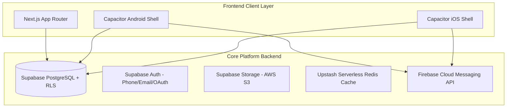

# 🏓 PICKLERS — Cross-Platform Pickleball Ecosystem

> **Find • Book • Play** — The premier pickleball court reservation, tournament management, and player community platform for Web, Android, and iOS.

---

## 🌟 Overview

**Picklers** is a unified multi-platform application designed for court facility owners, tournament directors, and pickleball players. Built with a shared high-performance architecture, Picklers delivers real-time court availability, instant GCash/Maya wallet checkout, live scoreboards, and lock-screen push notification alerts across all devices.

---

## 📱 Supported Platforms

| Platform | Engine / Tech | Target Binary | Build Status |
| :--- | :--- | :--- | :--- |
| **Web** | Next.js 16 (App Router), React 18, Vercel Edge | Hosted Web Application | 🟢 Production Ready |
| **Android** | Capacitor.js v6, Native Android SDK, FCM | `.apk` / `.aab` (Google Play) | 🟢 Configured & Synced |
| **iOS** | Capacitor.js v6, Xcode, APNs | `.ipa` (App Store / TestFlight) | 🟢 Configured & Synced |

---

## 🛠️ Unified Architecture & Tech Stack



- **Frontend & Styling:** React 18, TypeScript, Tailwind CSS v4, Motion, Lucide Icons, Radix UI.
- **Backend & Database:** Supabase PostgreSQL, Row Level Security (RLS), Edge Functions, Upstash Redis Rate Limiting.
- **Mobile Engine:** Capacitor.js v6, `@capacitor/preferences` (Native Auth Persistence), `@capacitor/app` (Paymongo Deep Linking).
- **Push Notifications:** Firebase Cloud Messaging (FCM) + APNs.
- **Payments:** Paymongo API (GCash, Maya, QR Ph, Card).

---

## 📁 Repository Structure

```text
├── android/                   # Generated native Android project
├── ios/                       # Generated native iOS project
├── src/                       # Application source code
│   ├── app/                   # Next.js App Router routes & API endpoints
│   ├── components/            # Reusable UI components & mobile providers
│   ├── contexts/              # Global state (Auth, App, Toast, Owner)
│   ├── lib/                   # Supabase clients, Capacitor storage & push utils
│   └── styles/                # Tailwind CSS v4 & custom design tokens
├── capacitor.config.ts        # Capacitor cross-platform configuration
├── package.json               # Dependencies and mobile build scripts
├── TECH_STACK_WEB.md          # Web technical specifications
├── TECH_STACK_ANDROID.md      # Android technical specifications
├── TECH_STACK_IOS.md           # iOS technical specifications
├── PRODUCT_SPEC.md            # Feature set & product scope
└── DESIGN_SYSTEM.md           # Brand colors, typography & aesthetic rules
```

---

## 🚀 Quick Start Guide

### 1. Installation
```bash
cd web
npm install
```

### 2. Development (Web App)
```bash
npm run dev
# App running at http://localhost:3000
```

### 3. Native Android Build
```bash
# Sync web code to native Android shell
npm run cap:sync:android

# Open project in Android Studio
npm run cap:android
```
*In Android Studio: Select **Build > Generate App Bundles or APKs > Generate APKs**.*

### 4. Native iOS Build
```bash
# Sync web code to native iOS shell
npm run cap:sync:ios

# Open project in Xcode
npm run cap:ios
```

---

## 📄 Documentation Index

- 📚 [DOCUMENTATION.md](DOCUMENTATION.md) — **Complete project documentation (start here)**
- 📘 [PRODUCT_SPEC.md](file:///c:/Users/Nitro/Desktop/PICKLERS%20WEB%20APP/PRODUCT_SPEC.md) — Product requirements and features
- 🎨 [DESIGN_SYSTEM.md](file:///c:/Users/Nitro/Desktop/PICKLERS%20WEB%20APP/DESIGN_SYSTEM.md) — Design tokens, brand identity, and Tailwind rules
- 💻 [TECH_STACK_WEB.md](file:///c:/Users/Nitro/Desktop/PICKLERS%20WEB%20APP/TECH_STACK_WEB.md) — Web architecture details
- 🤖 [TECH_STACK_ANDROID.md](file:///c:/Users/Nitro/Desktop/PICKLERS%20WEB%20APP/TECH_STACK_ANDROID.md) — Android wrapper & Gradle config
- 🍎 [TECH_STACK_IOS.md](file:///c:/Users/Nitro/Desktop/PICKLERS%20WEB%20APP/TECH_STACK_IOS.md) — iOS wrapper & Xcode config
- 🔥 [FIREBASE_PUSH_NOTIFICATIONS_GUIDE.md](file:///c:/Users/Nitro/Desktop/PICKLERS%20WEB%20APP/FIREBASE_PUSH_NOTIFICATIONS_GUIDE.md) — Step-by-step FCM setup
